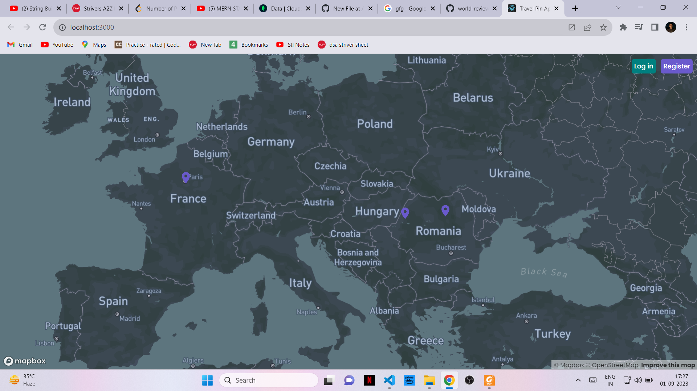
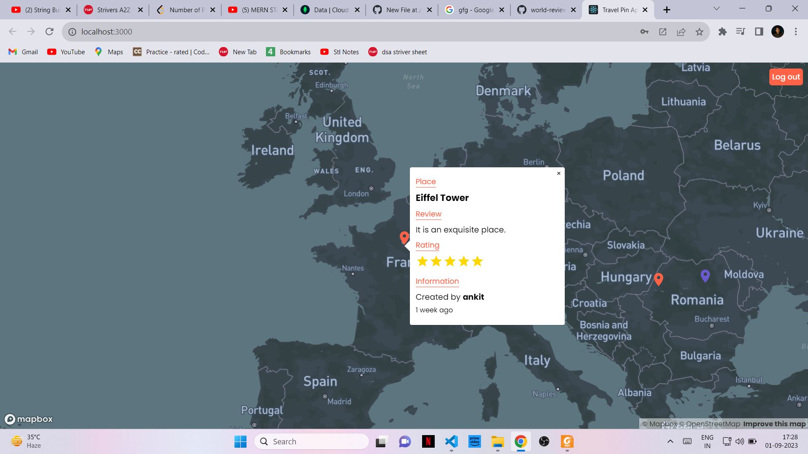
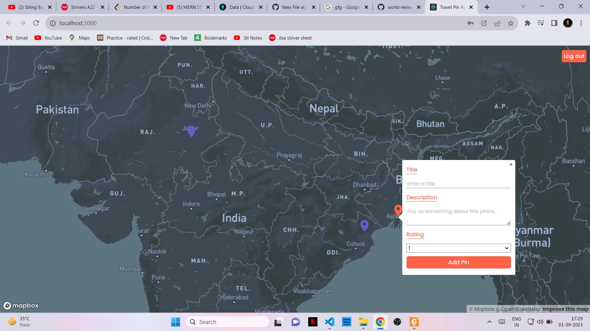

# World-Review

## Introduction:
- Tech Stack – React, NodeJs, Express, MongoDB

- Developed real-time map application using Mapbox API, allowing users to Sign Up and Login to review and rate
  worldwide locations. 

- Implemented user-friendly interface for users to write and view reviews, facilitating informed decision-making
  based on pros and cons of various places.
  
  
## Screenshots

### Created By- Ankit Raj
